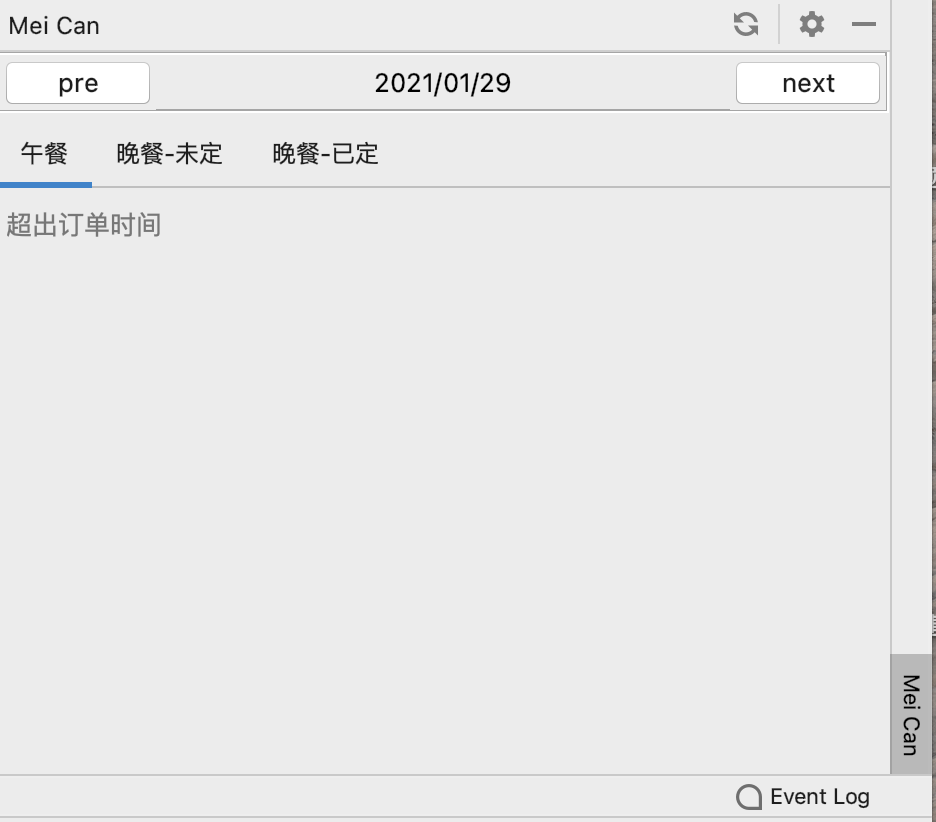
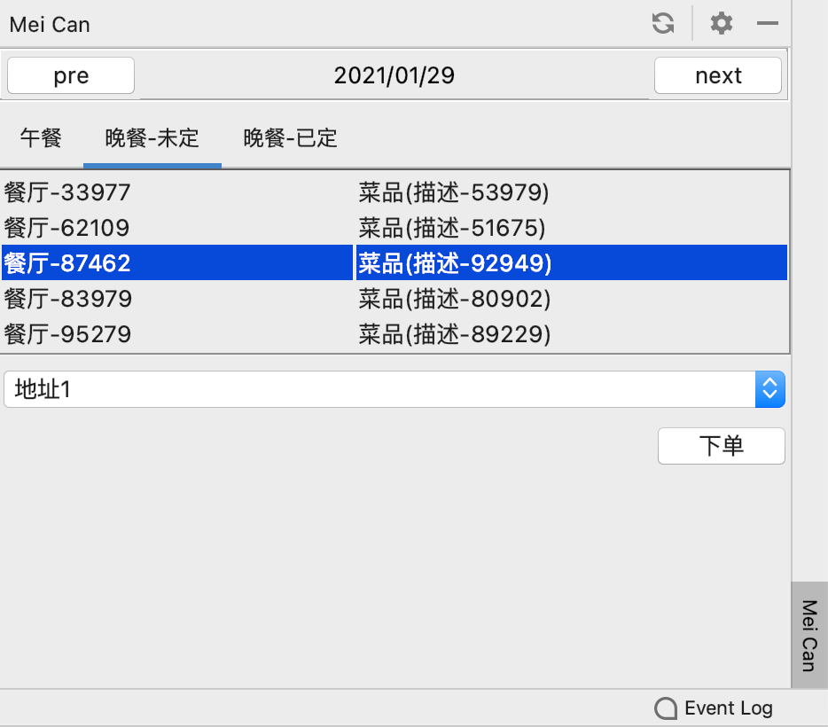
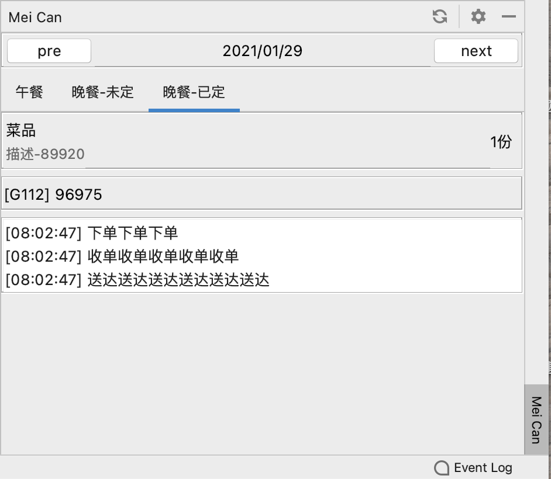

# meican-intellij-plugin

## 插件介绍
<!-- Plugin description -->
Mei Can plugin for IntelliJ based IDEs.
<!-- Plugin description end -->
插件提供在intellij中查看美餐订餐信息和订餐，目前可能尚不满足大部分情况。根据作者的使用情况进行编写，后续会逐步完善更多功能

### 功能
- 查看两周内的订餐情况
- 订餐
- 设置午餐晚餐截止时间前提醒
  - 如果已经订餐提醒订单信息
  - 如果未订餐提醒订单
  
## 安装

- 使用 IDE 内置插件系统安装:

  <kbd>Settings/Preferences</kbd> > <kbd>Plugins</kbd> > <kbd>Marketplace</kbd> > <kbd>Search for "meican-intellij-plugin"</kbd> >
  <kbd>Install Plugin</kbd>

- 手动安装:

  下载插件包 [latest release](https://github.com/motui/meican-intellij-plugin/releases/latest) >
  <kbd>Settings/Preferences</kbd> > <kbd>Plugins</kbd> > <kbd>⚙️</kbd> > <kbd>Install plugin from disk...</kbd> 选择插件安装（无需解压）
  
## 使用指南
1. 在设置页面设置账号信息和配置提醒
   
   
2. 在功能工具栏查看订餐面板
   
   
   
以上图示仅是演示效果，实际使用按照插件界面为准

## 声明
插件内使用的API为「美餐」的web端的接口，如存在违规请联系作者进行删除

---
Plugin based on the [IntelliJ Platform Plugin Template][template].

[template]: https://github.com/JetBrains/intellij-platform-plugin-template
