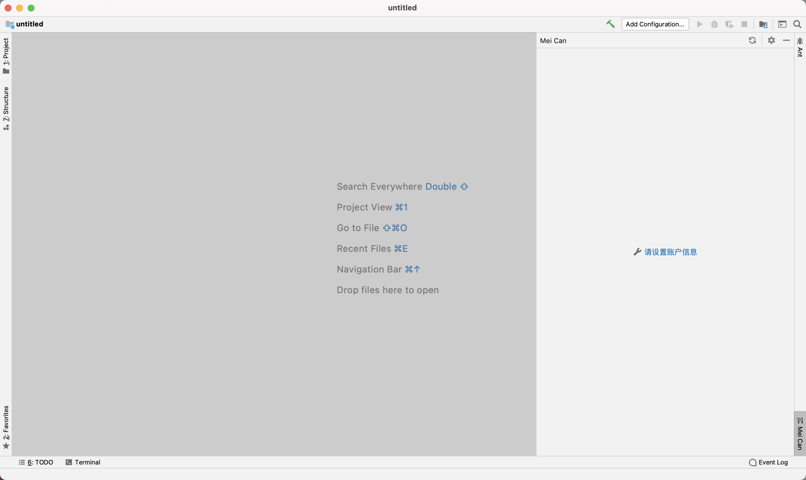
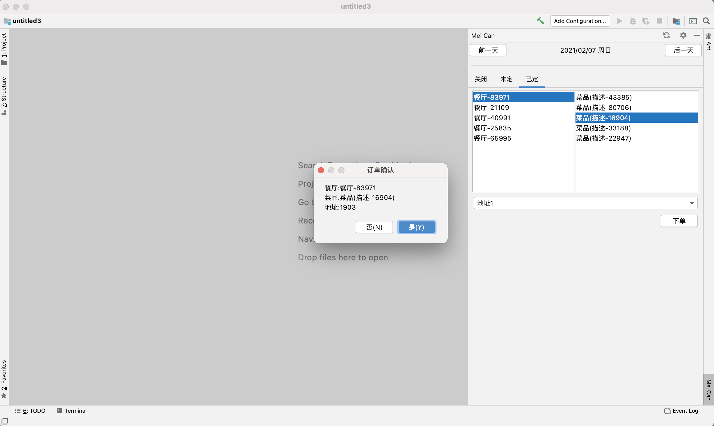
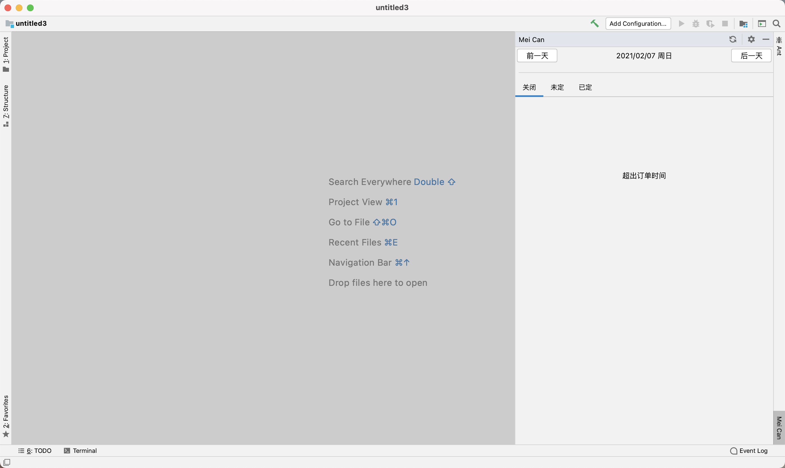

    

<h1 align="center">Intellij Mei Can</h1>

Mei Can plugin for IntelliJ based IDEs.

## 插件介绍

<!-- Plugin description -->
<!-- Plugin description end -->
插件提供在intellij中查看美餐订餐信息和订餐，目前可能尚不满足大部分情况。

根据作者的使用情况进行编写，后续会逐步完善更多功能

注意：目前仅对企业支付场景进行处理（可能尚不满足个人用户的场景），如有更多场景可在 [Issues](https://github.com/motui/meican-intellij-plugin/issues) 中反馈

### 功能

- 查看两周内的订餐情况
- 订餐和取消订餐
- 设置午餐晚餐截止时间前提醒
    - 如果已经订餐提醒订单信息
    - 如果未订餐提醒订餐
- 设置自动订餐 自动订餐为随机，地址默认第一个

### 规划

- [ ] 扩展自动订餐策略

## 兼容性
IntelliJ IDEA, PhpStorm, WebStorm, PyCharm, RubyMine, AppCode, CLion, Gogland, DataGrip, Rider, MPS, Android Studio

## 赞助

Development powered by [JetBrains](https://www.jetbrains.com/?from=).

Whichever technologies you use, there's a JetBrains tool to match.

## 安装

<iframe frameborder="none" width="245px" height="48px" src="https://plugins.jetbrains.com/embeddable/install/15969"></iframe>

- 使用 IDE 内置插件系统安装:

  <kbd>Settings/Preferences</kbd> > <kbd>Plugins</kbd> > <kbd>Marketplace</kbd> > <kbd>Search for "
  meican-intellij-plugin"</kbd> >
  <kbd>Install Plugin</kbd>

- 手动安装:

  下载插件包 [latest release](https://github.com/motui/meican-intellij-plugin/releases/latest) >
  <kbd>Settings/Preferences</kbd> > <kbd>Plugins</kbd> > <kbd>⚙️</kbd> > <kbd>Install plugin from disk...</kbd>
  选择插件安装（无需解压）

## 使用指南

1. 在设置页面设置账号信息和配置提醒
   
   

2. 在功能工具栏查看订餐面板
   

3. 下单面板
   

4. 订单确认面板
   

5. 下单通知
   

6. 查看订单
   
   

说明：以上图示仅是演示效果，实际使用按照插件界面为准

## 声明

插件内使用的API为「美餐」的web端的接口，如存在违规请联系作者进行删除

---
Plugin based on the [IntelliJ Platform Plugin Template][template].

[template]: https://github.com/JetBrains/intellij-platform-plugin-template
